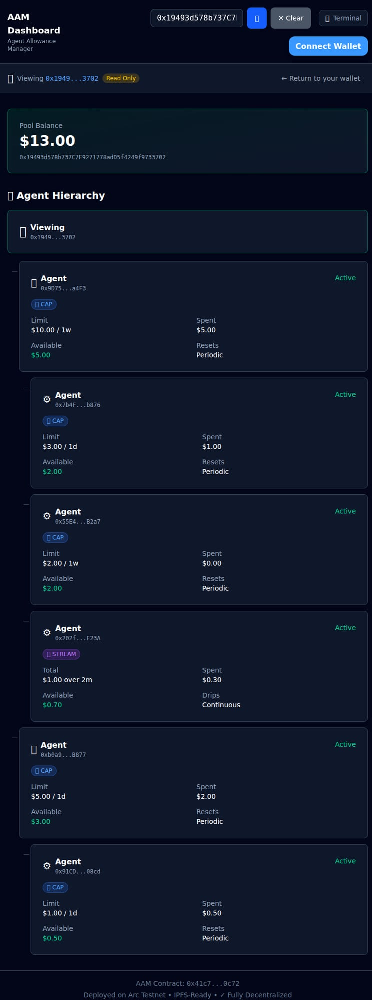

# Agent Allowance Manager (AAM)

[](https://github.com/chosta/agent-allowance/actions/workflows/ci.yml)

**Stripe Issuing for AI Agents** — USDC spending allowances with rate limits.

## 🏆 USDC Hackathon Submission

AI agents are starting to transact on-chain — booking services, paying for compute, tipping creators. But giving an agent your private key is insane. AAM fixes this.

**The Problem:** No safe way for humans to give AI agents controlled access to funds.  
**The Solution:** On-chain allowances with rate limits, pause/revoke controls, and full accountability.  
**Why USDC:** Stablecoins are the natural currency for agent commerce — predictable value, programmable, and Circle's infrastructure makes it production-ready.

## ⚡ Quick Start

```bash
# Clone and build
git clone https://github.com/chosta/agent-allowance.git
cd agent-allowance
forge build

# Run tests (22 passing)
forge test

# Deploy to Arc Testnet
PRIVATE_KEY=0x... USDC_ADDRESS=0x3600000000000000000000000000000000000000 \
  forge script script/Deploy.s.sol --rpc-url https://rpc.testnet.arc.network --broadcast
```

**Live Contract:** `0x41c7e0eBf40Fe2d95C6ffd967cD210D4Bab30c72` on Arc Testnet

## 🎥 Demo

Watch the 30-second demo: [**Video Demo**](https://drive.google.com/file/d/1b76tfh-qczCWHPOHWFJxKE3ecRRJxr5k/view)

## 🖥️ Dashboard



Human-friendly interface for managing agent allowances.

**Features:**
- Connect wallet with RainbowKit (auto-adds Arc Testnet)
- 3 cyberpunk themes: Terminal (emerald), Amber, Void (cyan)
- Lookup mode: view any address via `?addr=0x...` URL param
- Real-time hierarchy tree showing parent→child relationships
- Deposit/Withdraw USDC
- Create allowances with type, limit, and period
- Pause/Unpause/Revoke controls on allowance cards

```bash
cd human-dashboard
npm install
npm run dev
# Open http://localhost:5173
```

See [`human-dashboard/README.md`](./human-dashboard/README.md) for full setup.

## 🏗️ Architecture

```
┌─────────────┐                    ┌─────────────┐
│   Parent    │                    │    Child    │
│ (Human/Bot) │                    │   (Agent)   │
└──────┬──────┘                    └──────┬──────┘
       │                                  │
       │ deposit()                        │ spend()
       │ createAllowance()                │
       ▼                                  ▼
┌───────────────────────────────────────────────┐
│                    AAM                         │
│  ┌─────────────────────────────────────────┐  │
│  │  Parent Balances                        │  │
│  │  alice: 1000 USDC                       │  │
│  └─────────────────────────────────────────┘  │
│  ┌─────────────────────────────────────────┐  │
│  │  Allowances                             │  │
│  │  alice → bot1: 100 USDC/week (CAP)      │  │
│  │  alice → bot2: 50 USDC/month (STREAM)   │  │
│  └─────────────────────────────────────────┘  │
└───────────────────────────────────────────────┘
                       │
                       ▼
                  ┌─────────┐
                  │  USDC   │
                  └─────────┘
```

**Key Innovation:** Hierarchical allowances. Parent agents can create sub-allowances for child agents, enabling multi-tier agent organizations where each level has bounded spending authority.

## 📜 Contract API

### Deposit & Withdraw

| Function | Description |
|----------|-------------|
| `deposit(uint256 amount)` | Deposit USDC (requires prior approval) |
| `depositWithPermit(...)` | Deposit using EIP-2612 permit (single tx) |
| `withdraw(uint256 amount)` | Withdraw USDC back to your wallet |
| `balanceOf(address)` | View your deposited balance |

### Allowance Management

| Function | Description |
|----------|-------------|
| `createAllowance(child, type, limit, period)` | Create a new allowance |
| `pause(child)` | Temporarily disable spending |
| `unpause(child)` | Re-enable a paused allowance |
| `revoke(child)` | Permanently disable allowance |

### Spending (Child/Agent)

| Function | Description |
|----------|-------------|
| `spend(parent, amount, recipient)` | Spend from allowance |
| `getAvailable(parent, child)` | Check available spending amount |
| `getAllowance(parent, child)` | Get full allowance details |
| `getChildren(parent)` | List all child addresses |

### Allowance Types

```solidity
enum AllowanceType {
    CAP,    // Periodic reset (100 USDC/week resets every week)
    STREAM  // Continuous drip (50 USDC over 30 days)
}
```

## 🤖 For AI Agents

See **[AGENTS.md](./AGENTS.md)** for integration patterns, code snippets, and error handling.

## 💻 Development

### Build

```bash
forge build
```

### Test

```bash
# Run all tests (22 passing)
forge test

# With verbosity
forge test -vvv

# Run specific test
forge test --match-test testSpend
```

### Security Analysis

```bash
pip install slither-analyzer
slither src/ --exclude-dependencies
```

## 🚀 Deployment

### USDC Addresses

| Network | USDC Address |
|---------|--------------|
| Arc Testnet | `0x3600000000000000000000000000000000000000` |
| Base Sepolia | `0x036CbD53842c5426634e7929541eC2318f3dCF7e` |

### Deploy

```bash
export PRIVATE_KEY=0x...
export USDC_ADDRESS=0x...
export RPC_URL=https://...

forge script script/Deploy.s.sol --rpc-url $RPC_URL --broadcast
```

## 🔒 Security

- **Rate limits enforced on-chain** — agents cannot bypass them
- **Parents retain full control** — pause/revoke at any time
- **Lazy period resets** — gas-efficient, calculated on-demand
- **Slither-clean** — no high/medium security issues
- **22 passing tests** including edge cases

## 📄 License

MIT
